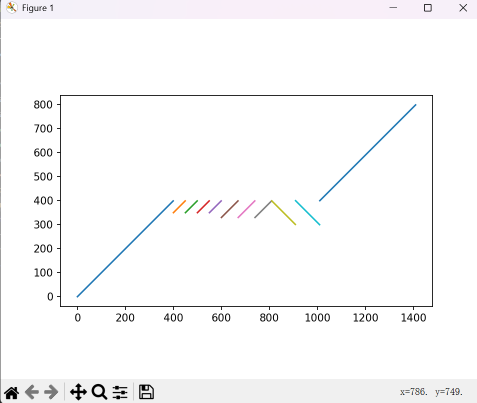

<link rel="stylesheet" href="https://cdn.jsdelivr.net/npm/katex@0.16.11/dist/katex.min.css" integrity="sha384-nB0miv6/jRmo5UMMR1wu3Gz6NLsoTkbqJghGIsx//Rlm+ZU03BU6SQNC66uf4l5+" crossorigin="anonymous">
<script src="https://cdn.jsdelivr.net/npm/katex@0.16.11/dist/katex.min.js" integrity="sha384-7zkQWkzuo3B5mTepMUcHkMB5jZaolc2xDwL6VFqjFALcbeS9Ggm/Yr2r3Dy4lfFg" crossorigin="anonymous"></script>

# 寻找样本DNA序列中的重复片段

23300240009 佟铭洋

## 对于下发的样例的输出

```
|--------------------------------------------------|
|                    Statistics                    |
|--------------------------------------------------|
| Pos in Ref | Pattern | Length | Inverted | Count |
|--------------------------------------------------|
| 400 -  799 | CT...AT |    400 |    False |     1 |
| 301 -  399 | AG...CG |     99 |     True |     1 |
| 330 -  399 | TA...CG |     70 |    False |     3 |
| 300 -  400 | CA...CC |    101 |     True |     1 |
| 350 -  399 | CT...CG |     50 |    False |     4 |
|   0 -  399 | CT...CG |    400 |    False |     1 |
|--------------------------------------------------|
```



## 思路

以下约定：$s$ 表示 reference 串，$t$ 表示 query 串。$s[i]$ 表示 reference 串的第 $i$ 个字符（从 $0$ 开始），$t[i:j]$ 表示 query 串的第 $i$ 到第 $j$ 个字符（包括首尾）。

$s$ 和 $t$ 的长度分别为 $n$ 和 $m$。

使用哈希表保存所有 reference 串的子串（以及逆转后的子串）。

使用 $f[k]$ 表示从 $t[k]$ 到 $t[n]$ （注意不是 $n-1$）的**最少跳转次数**（保证平均每个片段最长）。初始化 $f[k]$ 为无穷大，$f[n]$ 为 $0$。

对于 query 串的每个子串 $t[i:j]$，寻找其是否在 reference 中出现过。若出现过则尝试更新 $f[j]$。

**重点**

遍历 query 串每个子串的顺序非常重要。其实这里存在两种思路：从前往后扫和从后往前扫，理论上效果是一致的。此处使用从后往前扫。即先遍历所有 query 的后缀，然后是去掉最后一个字符的后缀，然后是去掉最后两个字符的后缀，以此类推。

**精细化处理**

- 保存是从哪里跳的，简单记录即可，以下不再介绍。
- $\Theta(1)$ 求子串哈希，以下将介绍。
- 美观输出，与算法无关，以下不再介绍。

## 程序

- `final.cpp` **需要使用 C++20 编译，因为使用了 std::unordered_map::contains 这个语法糖，若没有对应环境请改成std::unordered_map::find != std::unordered_map::end**
- `plot.py` 用于画图。

## 伪代码

<pre class="pseudocode">
\begin{algorithm}
\caption{PreHash}
\begin{algorithmic}
\PROCEDURE{PreHash}{$s, l, r, ht$}
    \STATE $h \gets 0$
    \FOR{$i \gets l$ \TO $r - 1$}
        \STATE $h \gets h \times 131 + s[i]$
        \STATE $ht[i] \gets h$
    \ENDFOR
\ENDPROCEDURE
\end{algorithmic}
\end{algorithm}
</pre>
<pre class="pseudocode">
\begin{algorithm}
\caption{PreHashInv}
\begin{algorithmic}
\PROCEDURE{PreHashInv}{$l, r, s, ht$}
    \STATE $n \gets$ \CALL{Length}{$s$}
    \FOR{$i \gets 0$ \TO $n - 1$}
        \STATE $reference\_rc[i] \gets s[n - i - 1]$
    \ENDFOR
    \STATE $reference\_rc[n] \gets \text{NULL}$
    \FOR{$i \gets 0$ \TO $n - 1$}
        \IF{$reference\_rc[i] = 'A'$}
            \STATE $reference\_rc[i] \gets 'T'$
        \ELIF{$reference\_rc[i] = 'T'$}
            \STATE $reference\_rc[i] \gets 'A'$
        \ELIF{$reference\_rc[i] = 'C'$}
            \STATE $reference\_rc[i] \gets 'G'$
        \ELSE
            \STATE $reference\_rc[i] \gets 'C'$
        \ENDIF
    \ENDFOR
    \STATE \CALL{Hash}{$0, n, reference\_rc, ht$}
\ENDPROCEDURE
\end{algorithmic}
\end{algorithm}
</pre>
<pre class="pseudocode">
\begin{algorithm}
\caption{PartialHash}
\begin{algorithmic}
\FUNCTION{PartialHash}{$l, r, ht$}
    \IF{$l = 0$}
        \RETURN $ht[r]$
    \ENDIF
    \RETURN $ht[r] - ht[l - 1] \times pow131[r - l + 1]$
\ENDFUNCTION
\FUNCTION{PartialHashInv}{$l, r, n, htinv$}
    \RETURN \CALL{PartialHash}{$n - r - 1, n - l - 1, htinv$}
\ENDFUNCTION
\end{algorithmic}
\end{algorithm}
</pre>
<pre class="pseudocode">
\begin{algorithm}
\caption{PartialHash}
\begin{algorithmic}
\PROCEDURE{ComputeF}{$query\_len, hash\_query, substrings, f, f\_from$}
    \STATE \CALL{Memset}{$f, \infty, \text{SizeOf}(f)$}
    \STATE $f[query\_len] \gets 0$

    \FOR{$i \gets query\_len - 1$ \TO $0$}
        \FOR{$j \gets i$ \TO $query\_len - 1$}
            \STATE $h \gets$ \CALL{PartialHash}{$i, j, hash\_query$}
            \IF{$h \in substrings$}
                \STATE $jump\_from \gets j + 1$
                \IF{$f[i] > 1 + f[jump\_from]$}
                    \STATE $f[i] \gets 1 + f[jump\_from]$
                    \STATE $begin \gets substrings[h].begin$
                    \STATE $inverted \gets substrings[h].inverted$
                    \STATE $f\_from[i] \gets \{jump\_from, begin, inverted\}$
                \ENDIF
            \ENDIF
        \ENDFOR
    \ENDFOR
\ENDPROCEDURE
\end{algorithmic}
\end{algorithm}
</pre>

## 复杂度分析

### 时间复杂度

- 预处理幂 $\Theta(n+m)$。
- 预处理哈希 $\Theta(n+m)$。
- 预处理所有 reference 子串哈希 $\Theta(n^2)$。
- 预处理所有 reference 逆转子串哈希 $\Theta(n^2)$。
- 计算 $f$ 数组 $\Theta(m^2)$。
- 回溯 $O(m)$。

总时间复杂度为 $\Theta(n^2 + m^2)$。

<script src="https://cdn.jsdelivr.net/npm/katex@0.16.11/dist/contrib/auto-render.min.js" integrity="sha384-43gviWU0YVjaDtb/GhzOouOXtZMP/7XUzwPTstBeZFe/+rCMvRwr4yROQP43s0Xk" crossorigin="anonymous" onload="renderMathInElement(document.body, {delimiters: [{left: '$$', right: '$$', display: true},{left: '$', right: '$', display: false},{left: '\\(', right: '\\)', display: false},{left: '\\[', right: '\\]', display: true}],throwOnError : false});"></script>

<link rel="stylesheet" href="https://cdn.jsdelivr.net/npm/pseudocode@latest/build/pseudocode.min.css">
<script src="https://cdn.jsdelivr.net/npm/pseudocode@latest/build/pseudocode.min.js" onload="pseudocode.renderClass('pseudocode')"></script>